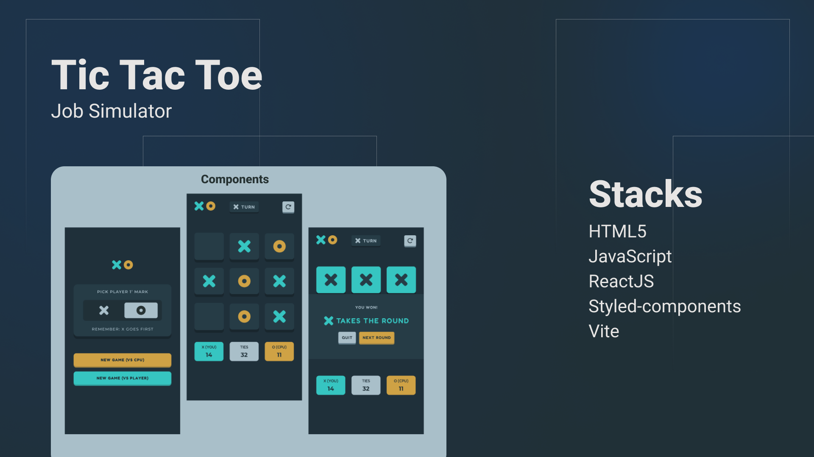

<h1 align="center"> Tic Tac Toe Game </h1>
<h4 align="center"> Em construção </h4>

Projeto pessoal para praticar conhecimentos adquiridos em Lógica de Programação com JavaScript e React JS .

  <a href="#Tecnologias">Tecnologias</a>&nbsp;&nbsp;&nbsp;|&nbsp;&nbsp;&nbsp;
  <a href="#Projeto">Projeto</a>&nbsp;&nbsp;&nbsp;|&nbsp;&nbsp;&nbsp;
  <a href="#Layout">Layout</a>&nbsp;&nbsp;&nbsp;|&nbsp;&nbsp;&nbsp;
  <a href="#Aprendizado">O que aprendi</a>

 

  

## Tecnologias

Esse projeto está sendo desenvolvido com as seguintes tecnologias:

- [HTML](https://developer.mozilla.org/pt-BR/docs/Web/HTML)
- [JavaScript](https://developer.mozilla.org/pt-BR/docs/Web/JavaScript)
- [React JS](https://pt-br.reactjs.org/)
- [Styled-components](https://styled-components.com/)
- [Node e NPM](https://nodejs.org/)
- [Vite](https://vitejs.dev/)

## Projeto

O Tic Tac Toe Game é uma aplicação SPA ([Single Page Application](https://en.wikipedia.org/wiki/Single-page_application)) que permite o usuário jogar o jogo conhecido como [Jogo da Velha](https://pt.wikipedia.org/wiki/Jogo_da_velha)

Esta aplicação foi proposta como um dos desafios do site [Frontend Mentor](https://www.frontendmentor.io/challenges/tic-tac-toe-game-Re7ZF_E2v).

### Requisitos funcionais

- [x] Configurações iniciais
  - [x] Usuário escolhe se quer jogar uma das opções (**X** ou **O**)
  - [x] Usuário escolhe contra quem quer jogar (**CPU** ou **Humano**)

*Para a primeira versão do jogo, será disponibilizada apenas a opção para jogar contra outro humano*

*O jogo sempre começa com X*
Ou seja, caso o usuário escolha **O** e selecione pra jogar contra CPU ou Humano, qualquer um deste dará início ao jogo com **X**

*Condições de vitória*
O primeiro jogador que conseguir combinar suas jogadas ao ponto de ter 3 peças alinhadas nos eixos vertical, horizontal ou diagonal será o vencedor.

## Desenvolvimento
### Sprint 1: Protótipo e início do projeto
Inicio: 16/12/2022 | Fim: 23/12/2022

**Tarefas**
- [x] Criar protótipo do design no Figma
  - [x] Versão mobile
- [x] Inicializar projeto
  - [x] Configurar arquivos iniciais e instalar dependências
  - [x] Planejar arquitetura do projeto, definindo estrutura de arquivos
  - [x] Construir README
- [x] Criação dos componentes
  - [x] GameSetup
    - [x] Criar componentes e seus respectivos estilos
    - [x] Implementar funções para realizar interações necessárias
      - [x] Função para selecionar a opção de início entre X e O
        - [x] Mudar o visual 
        - [x] Desabilitar o botão quando clicado
      - [x] Função para ir para o próximo estágio do jogo após configurações inicias
  - [x] GamePlay
    - [x] Criar componentes e seus respectivos estilos
    - [x] Implementar funções para realizar interações necessárias
git
- Haverá um array contendo as jogadas disponiveis, para controlar as jogadas possiveis pela CPU. Exemplo: [0, 1, 2, 3, 4, 5, 6, 7, 8];
- Haverá um array que armazenará as jogadas realizadas pelo usuário; o mesmo será inicializado vazio;

- Quando usuario jogar:
- [x] Desabilita o botão clicado;
- [x] Retira um número do array de jogadas disponíveis;
- [x] Insere o número clicado no array de jogadas do usuário

- Quando a CPU jogar:
- [x] Desabilita o botão escolhido;
- [x] Retira um número do array de jogadas disponíveis;
- [x] Insere o número clicado no array de jogadas da CPU;

- Verificar condição de vitória
Haveram arrays contendo todas as combinações possíveis que levam um dos jogadores à vitória; cada array será composto por 3 jogadas cada. 
Uma condição de vitória será satisfeita quando um dos jogadores atingir as jogadas necessárias de acordo com os arrays.
Os elementos de cada array das condições de vitória serão checados para verificar se fazem parte das opções jogadas pelo usuário. Caso os 3 elementos de um dos arrays estejam incluídos entre as jogadas feitas pelo usuário, tem-se o vencedor.

### Sprint 2: Implementar condição de vitória
Inicio: 02/01/2023 | Fim: 09/01/2023

**Tarefas**

*GamePlay*

- [x] Criar lista com todas as condições de vitória possíveis
- [x] Criar função para validar condição de vitória para cada jogador
- [x] Criar função para atualizar o placar durante as seções de jogo
  - [x] Placar do Player 1
  - [x] Placar do Player 2
  - [x] Placar do empate
- [x] Criar função para renderizar o componente GameOver ao finalizar as jogadas (empate), ou caso um dos jogadores vença.

*GameOver*

- [x] Criar componente conforme layout para apresentar o resultado do jogo
- [x] Criar condições para um novo jogo
  - [x] Permitir continuar jogando (um novo jogo será iniciado incrementando a contagem do placar)
  - [x] Reiniciar o jogo, zerando o placar.

## Layout

Utilizei o Figma para construção dos componentes e montagem do layout, com base nas imagens fornecidas pelo site Frontend Mentor, visto que o desafio faz parte do pacote Premium do qual não sou assinante.

## Aprendizado

- CSS in JS com Styled-components:
  
  Desde que começei a trabalhar com React JS, utilizei CSS de várias formas, dentre elas: CSS modules, Saas, Bootstrap e Tailwind. Mas até então não havia trabalhado tão diretamente com a biblioteca styled-components; desenvolvi os componentes dos meus útimos projetos em React JS utilizando utilizando o CSS.
  Tem sido uma ótima experiência, pois tem me propiciado a voltar a usar o CSS de forma mais pura.

- React Hooks 

  Especialmente os hooks useCallBack e useEffect foram de suma importância para gerenciar os estados corretamente, a fim de apresentar os resultados esperados.

---

Feito por [Anderson Vieira](https://linkedin/in/vieira-a)